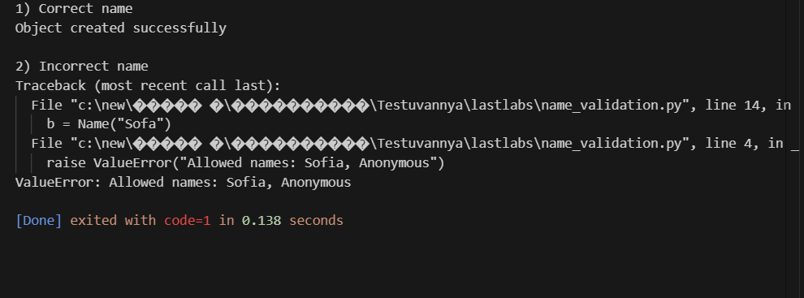
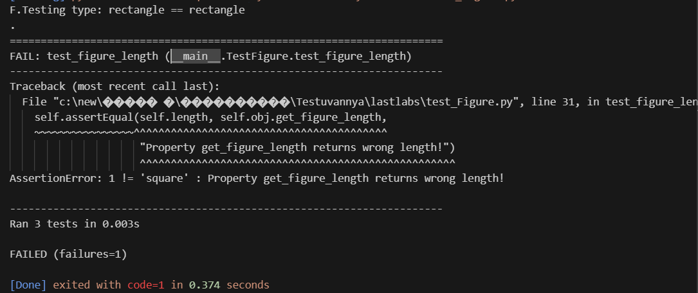
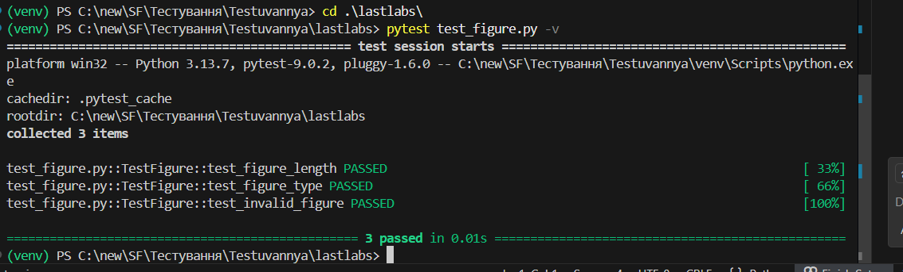
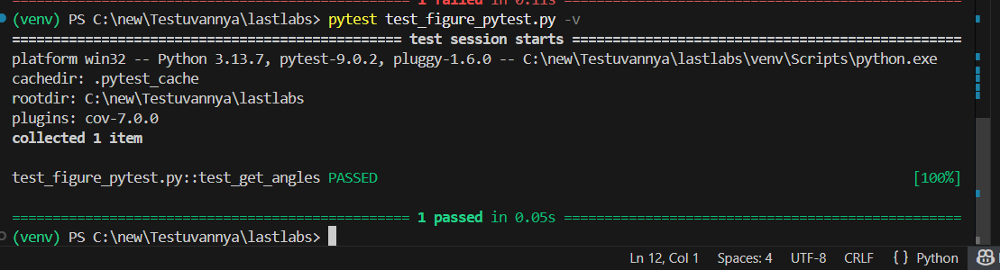

# Звіт до роботи
## Тема:Тестування програм (UnitTests та PyTests)

### Мета роботи:сформувати практичні навички тестування програмного забезпечення шляхом ознайомлення з юніт-тестуванням та фреймворком PyTest, навчитися створювати автоматизовані тести для окремих частин коду, перевіряти коректність роботи функцій і логіку поведінки програм у різних сценаріях, а також опанувати інструменти аналізу покриття коду тестами (coverage) й підготувати код до подальшої автоматизації тестування в CI/CD-процесах, зокрема з використанням GitHub Actions.

---
### Виконання роботи
* Результати виконання завдання *3*;
    1. Отримала такі результати: Програма працює згідно очікувань:Код виконує свій функціонал без помилок,
    2. Навчилася використовувати основні конструкціїї мови Python,виконала всі поставлені завдання,

* вставлені рисунки :
    
    test_figure.py приклад:результату тесту,який виводить помилку:
    
Завдання 3
    
    Завдання 4
    

* вставлений код / текстовий або числовий результат / інші результати:

class TestFigure(unittest.TestCase):

    def setUp(self) -> None:
        self.figure_type = choice(Figure.FIGURES)
        self.length = randint(1, 10)
        self.obj = Figure(self.figure_type, self.length)
        return super().setUp()

    def tearDown(self) -> None:
        del self.obj
        return super().tearDown()

    def test_figure_type(self):
        self.assertEqual(self.obj.type, self.figure_type,
                         f"Expected {self.figure_type}, got {self.obj.type}")

    def test_figure_length(self):
        self.assertEqual(self.obj.length, self.length,
                         f"Expected {self.length}, got {self.obj.length}")

    def test_invalid_object(self):
        with self.assertRaises(AssertionError):
            Figure("circle", 1) 

if __name__ == '__main__':
    unittest.main()

* результати виконання індивідуального завдання (якщо такі є);

---
### Висновок:
---

## 1. Виконана робота

- Опрацьовано основні поняття, принципи та підходи до тестування програмного забезпечення.
- Реалізовано власні класи (`Figure`, `Name`) з метою перевірки коректності введених даних.
- Застосовано механізми валідації даних із використанням інструкцій `assert` та обробки помилок через `raise ValueError`.
- Створено та виконано модульні тести за допомогою бібліотеки `unittest`.
- Ознайомленося з можливостями фреймворку `pytest` та запуском тестів через термінал середовища VS Code.
- Використано інструменти `coverage` / `pytest-cov` для аналізу рівня покриття коду тестами.
- Розширено функціональність класів новими методами (зокрема `get_angles`) та перевірено їх коректність за допомогою тестів.
- Практично опрацьовано повний цикл тестування: запуск тестів, збір інформації про покриття та формування HTML-звітів.

## 2. Досягнення мети роботи

Мету лабораторної роботи досягнуто: засвоєно базові принципи тестування програмного коду, реалізовано автоматизовані тести та отримано звіти про покриття коду.

## 3. Отримані знання та навички

- Сформовано розуміння принципів юніт-тестування та автоматизованої перевірки програм.
- Набуто практичного досвіду роботи з бібліотеками `unittest` і `pytest`.
- Отримано навички аналізу покриття коду тестами за допомогою інструментів `coverage` та створення HTML-звітів.
- Поглиблено знання методів перевірки коректності даних у класах із використанням `assert` і `ValueError`.
- Освоєно організацію, запуск і налагодження тестів у середовищі VS Code та через командний рядок.

## 4. Відповіді на питання, поставлені під час виконання роботи

Усі питання, пов’язані зі створенням тестів, валідацією даних та аналізом покриття коду, були детально розглянуті та опрацьовані.

## 5. Виконання всіх завдань

Усі лабораторні приклади, тестові сценарії та додаткові завдання виконано в повному обсязі відповідно до вимог.

## 6. Труднощі під час виконання роботи

- На початковому етапі виникли труднощі з налаштуванням віртуального середовища та встановленням бібліотек `pytest` і `coverage`.
- Проблеми, пов’язані з імпортом класів і наявністю застарілих `.pyc` файлів, були успішно усунені.

## 7. Оцінка формату здачі роботи (Feedback)

Обраний формат виконання та здачі роботи є зручним і наочним, оскільки дозволяє поетапно відстежувати процес написання коду, тестів та аналіз покриття за допомогою HTML-звітів.

## 8. Пропозиції щодо покращення (Suggestions)

- Доцільно розширити кількість практичних завдань, орієнтованих на створення класів та написання тестів до них.
- Варто додати приклади автоматизації тестування з використанням GitHub Actions для демонстрації CI/CD-процесів.
- Запропонувати завдання, що поєднують використання `assert`, `unittest` і `pytest` у різних сценаріях перевірки.

