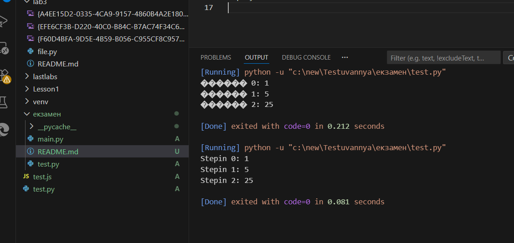

# Екзаменаційний білет 19
# Практичне Завдання

- запускаємо програму:
  ```bash
  python test.py
  ```
ЧАСТИНА КОДУ :
```
from main import calc_power
print("Stepin 0:", calc_power(5, 0)) 
print("Stepin 1:", calc_power(5, 1))  
print("Stepin 2:", calc_power(5, 2))

```
- результат
